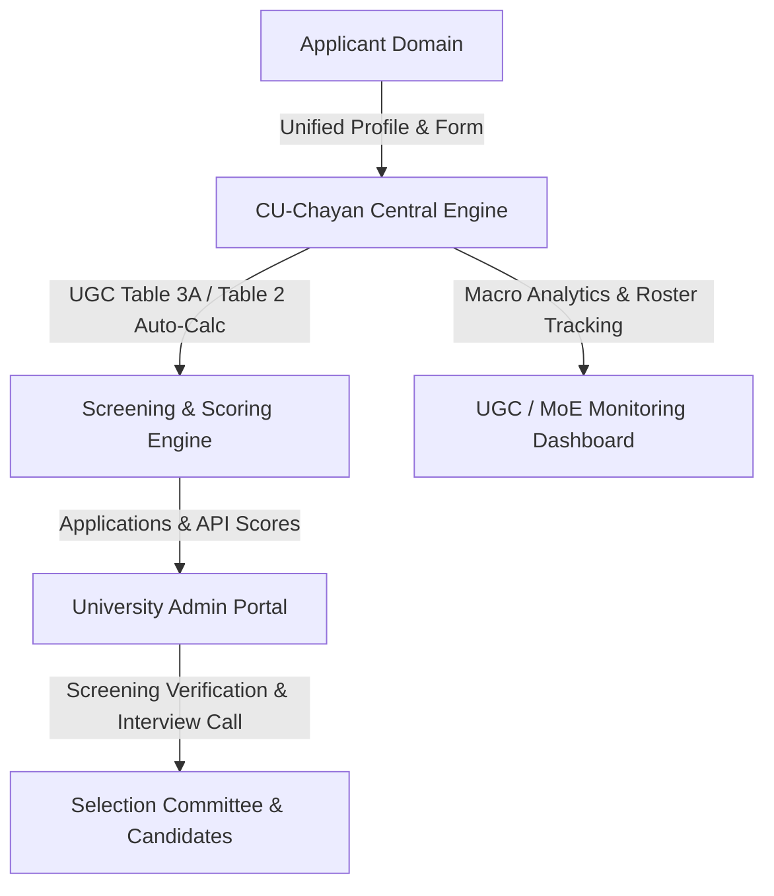
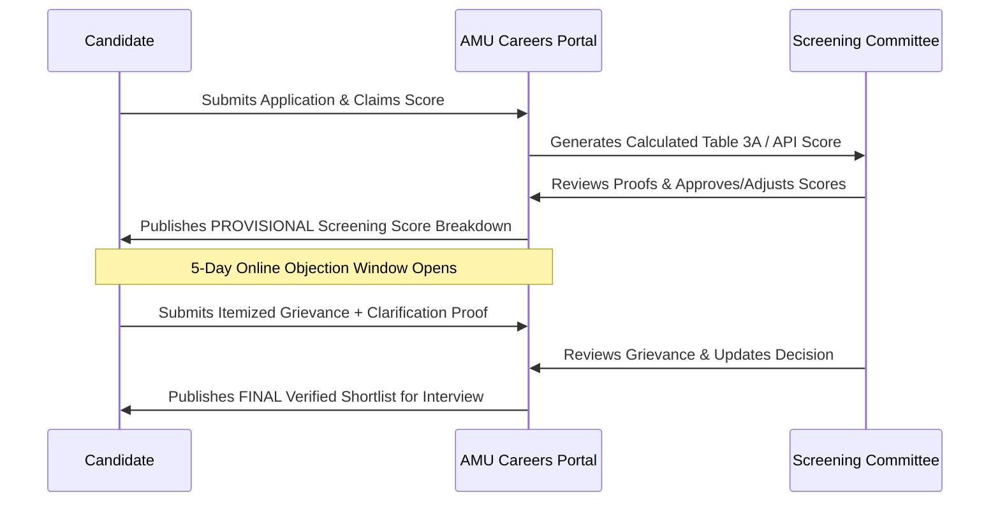

# CU-Chayan Recruitment Portal: In-Depth Evaluation, User Feedback Analysis & Next-Generation Portal Recommendations

> **Target Platform Evaluated:** CU-Chayan (Central University Recruitment Portal - `https://curec.samarth.ac.in`)  
> **Host Architecture:** Samarth eGov Suite (Ministry of Education & University Grants Commission)  
> **Document Purpose:** Critical assessment of the architecture, advantages, shortcomings, and user sentiments regarding CU-Chayan, concluding with high-impact actionable recommendations to make the **AMU Careers (Beta Careers) Portal** the benchmark higher education recruitment platform in India.

---

## Table of Contents
1. [Executive Summary](#1-executive-summary)
2. [Architectural Overview & Workflow of CU-Chayan](#2-architectural-overview--workflow-of-cu-chayan)
3. [Key Advantages & Strengths (Pros)](#3-key-advantages--strengths-pros)
4. [Critical Drawbacks, Pain Points & Public Criticisms (Cons)](#4-critical-drawbacks-pain-points--public-criticisms-cons)
   - [A. Opacity in Screening & Lack of Public Accountability](#a-opacity-in-screening--lack-of-public-accountability)
   - [B. The "Dual-Submission" Friction (Mandatory Offline Hard Copies)](#b-the-dual-submission-friction-mandatory-offline-hard-copies)
   - [C. Deficient Grievance Redressal Architecture](#c-deficient-grievance-redressal-architecture)
   - [D. Document Management & Technical Bottlenecks](#d-document-management--technical-bottlenecks)
   - [E. University Autonomy & Schema Inflexibility](#e-university-autonomy--schema-inflexibility)
   - [F. Payment Gateway & Transaction Reconciliation Errors](#f-payment-gateway--transaction-reconciliation-errors)
   - [G. Single Point of Failure & System Outages](#g-single-point-of-failure--system-outages)
5. [Public Discourse & Stakeholder Feedback Summary](#5-public-discourse--stakeholder-feedback-summary)
6. [Strategic Blueprint & Feature Recommendations for AMU Careers Portal](#6-strategic-blueprint--feature-recommendations-for-amu-careers-portal)

---

## 1. Executive Summary

In May 2023, the University Grants Commission (UGC) launched **CU-Chayan** (`curec.samarth.ac.in`), a unified faculty recruitment platform designed to centralize and standardize the hiring process across all Central Universities in India.

While CU-Chayan successfully consolidated multi-university job listings and eliminated repetitive baseline profile creation for applicants, its real-world implementation has revealed notable usability hurdles, procedural redundancies, technical rigidities, and transparency concerns.

This document analyzes the feedback from applicants, screening committee members, and academic associations, translating those insights into architectural specifications for the **AMU Careers (Beta Careers)** recruitment portal.

---

## 2. Architectural Overview & Workflow of CU-Chayan

CU-Chayan is divided into three primary functional domains:



1. **Unified Candidate Lifecycle**: Single Sign-On (SSO) with reusable profile blocks for Personal Info, Academic Qualifications, Research Publications (UGC Table 2), Teaching Experience, and Document Vault.
2. **Dynamic Screening Calculator**: Automates points calculation according to UGC Table 3A (for Assistant Professors) and Table 2 (Research Scores for Associate Professors/Professors).
3. **University Administration Module**: Allows individual Central Universities to publish advertisements, manage vacancy rosters, review applications, assign screening committees, and schedule interviews.
4. **National Monitoring Dashboard**: Gives UGC and the Ministry of Education visibility over vacancy fill rates, reservation roster compliance, and recruitment turnaround times.

---

## 3. Key Advantages & Strengths (Pros)

| Advantage | Practical Benefit to Stakeholders |
| :--- | :--- |
| **Centralized Discovery** | Candidates access a single national hub listing active faculty vacancies across all 45+ Central Universities, eliminating the need to monitor individual university websites. |
| **Single Profile Repository** | Applicants fill extensive academic credentials, research papers, books, and experience details once, reusing them across multiple university applications. |
| **Automated Table 3A/2 Score Calculation** | Eliminates manual arithmetic errors in API score computation by applying statutory UGC formulas directly to submitted data. |
| **Standardized Application Format** | Normalizes application fields across institutions, ensuring applicants submit all mandatory proofs and reducing incomplete applications. |
| **Macro Recruitment Monitoring** | Enables administrative oversight by UGC to track reservation compliance and expedite backlog recruitment drives. |

---

## 4. Critical Drawbacks, Pain Points & Public Criticisms (Cons)

Despite its strengths, extensive user feedback from academic forums, teachers' associations (such as AADTA, DUTA), and applicant communities highlights significant shortcomings:

### A. Opacity in Screening & Lack of Public Accountability
* **Candidate Isolation**: On CU-Chayan, candidates can only view their own screening score on their personal dashboard. They cannot see the category-wise cutoff scores, the total number of applicants shortlisted, or the relative scores of other candidates.
* **Arbitrary Score Deductions**: When university screening committees deduct points for claimed research papers or experience, candidates are rarely provided itemized rationale or feedback on why a particular claim was rejected.

### B. The "Dual-Submission" Friction (Mandatory Offline Hard Copies)
* **Pseudo-Digital Workflow**: Despite completing comprehensive online applications and paying fees through CU-Chayan, **most Central Universities still mandate that applicants print out the entire application form, attach self-attested physical photocopies of all certificates/publications, and send them via Speed Post / Courier** before a tight deadline.
* **Unfair Disqualifications**: Postal delays or transit damage frequently result in candidates being summarily rejected despite on-time online submission.

### C. Deficient Grievance Redressal Architecture
* **Lack of Integrated Objection Window**: When provisional screening scores are generated, CU-Chayan lacks a structured, time-bound in-portal mechanism for candidates to challenge scoring errors or upload missing clarification documents.
* **Email Black Hole**: Candidates are directed to email generic university recruitment email addresses, which often go unacknowledged or unaddressed before interview call letters are dispatched.

### D. Document Management & Technical Bottlenecks
* **Strict File Size Limitations**: Low upload size limits (e.g. 200 KB – 500 KB per document) force applicants to excessively compress multi-page Ph.D. theses, books, or certificates, frequently rendering text illegible.
* **Cumbersome Multi-Paper Uploads**: Uploading 20+ research papers requires manual entry for each paper individually without batch import, citation lookup (e.g., DOI / CrossRef / PubMed import), or automatic UGC-CARE verification.
* **No Inline Document Viewer**: University screening committees must download hundreds of individual ZIP archives or loose PDFs rather than reviewing candidate dossiers via a seamless split-screen browser reader.

### E. University Autonomy & Schema Inflexibility
* **Rigid Form Schemas**: CU-Chayan applies a one-size-fits-all form structure that fails to accommodate specialized departments (e.g., Medical Colleges, Architecture, Performing Arts, Engineering) which have distinct Council requirements (NMC, CoA, AICTE, BCI).
* **Statute & Ordinance Collisions**: Many historic Central Universities have unique institutional statutes, internal promotion criteria, or local reservation procedures that conflict with CU-Chayan's standardized fields.

### F. Payment Gateway & Transaction Reconciliation Errors
* **Double Deductions**: High transaction failure rates during closing hours, where money is deducted from the applicant's bank account but the application status remains "Unpaid".
* **Delayed Auto-Reconciliation**: Candidates are forced to make duplicate payments due to fear of missing the application deadline.

### G. Single Point of Failure & System Outages
* **Traffic Congestion**: Server sluggishness and timeouts occur during peak hours when multiple Central Universities share concurrent application deadlines.
* **Legal Vulnerability**: Any systemic legal stay or writ petition challenging CU-Chayan's portal mechanisms risks disrupting recruitment schedules across multiple institutions simultaneously.

---

## 5. Public Discourse & Stakeholder Feedback Summary

```
┌─────────────────────────────────────────────────────────────────────────────┐
│                            VOICE OF THE STAKEHOLDERS                        │
├─────────────────────────────────────────────────────────────────────────────┤
│ 🧑‍🎓 APPLICANTS:                                                               │
│   • "Why do I have to post 200 pages of hard copies after applying online?"   │
│   • "My screening score was reduced from 85 to 60 with no explanation."    │
│   • "Payment failed at 11:50 PM on deadline day; had to pay twice."         │
│                                                                             │
│ 🏛️ UNIVERSITIES & SCREENING COMMITTEES:                                      │
│   • "Downloading separate PDFs for 1,000 applicants is painfully slow."     │
│   • "The portal does not accommodate our Faculty of Medicine requirements."│
│                                                                             │
│ 📢 TEACHERS' ASSOCIATIONS:                                                  │
│   • "The portal centralizes authority and compromises university autonomy."│
│   • "Screening lists must be made public to prevent arbitrary favoritism."  │
└─────────────────────────────────────────────────────────────────────────────┘
```

---

## 6. Strategic Blueprint & Feature Recommendations for AMU Careers Portal

To make the **AMU Careers (Beta Careers)** portal superior to CU-Chayan, the following innovations and architectural improvements should be incorporated into the development roadmap:

---

### Recommendation 1: Two-Stage Transparent Screening with Built-In Grievance Window



* **Action Item**: Implement a transparent, two-stage screening process:
  1. **Provisional Score Disclosure**: Release an itemized candidate score breakdown showing points awarded vs. points deducted per category with specific committee remarks.
  2. **In-Portal Grievance Tab**: Provide a dedicated 5-to-7 day window where candidates can submit objections and upload clarifying documents directly inside the portal without needing offline emails.

---

### Recommendation 2: 100% Paperless Digital Dossier (Eliminate Postal Hard Copies)

* **Current Issue in CU-Chayan**: Mandatory speed-post submission of hard copies.
* **AMU Careers Solution**:
  - Automatically compile the candidate's complete application, verified certificates, and publications into a single, watermarked, bookmarked **Master Digital Dossier (PDF)**.
  - Implement a **QR-Code Digital Verification Stamp** on the summary page.
  - Provide the Selection Committee with an integrated, high-speed split-screen document viewer in the browser, eliminating the need for printing physical dossiers.

---

### Recommendation 3: Smart DOI / ISSN Lookup & Automated UGC-CARE Validation

* **Current Issue in CU-Chayan**: Candidates manually type ISSN, journal names, impact factors, and citations for dozens of publications.
* **AMU Careers Solution**:
  - Integrate **DOI / CrossRef API**: When a candidate enters a DOI, automatically fetch paper title, author list, journal name, year, volume, and issue.
  - **UGC-CARE List Auto-Verification**: Maintain a searchable database table of UGC-CARE, Scopus, and Web of Science indexed journals to automatically validate indexing status and prevent fraudulent claims.

---

### Recommendation 4: Resilient Multi-Gateway Payment Architecture with Instant Auto-Reconciliation

* **Current Issue in CU-Chayan**: Payment status hangs upon gateway drop-offs.
* **AMU Careers Solution**:
  - Implement dual-gateway support (e.g., SBI ePay / HDFC / Razorpay) with automatic failover.
  - Real-time Server-to-Server Webhook listener with automated background retry jobs every 5 minutes to instantly verify pending transactions before candidates attempt duplicate payments.

---

### Recommendation 5: Client-Side Document Pre-Processing & Bulk Uploader

* **Current Issue in CU-Chayan**: Severe upload errors due to strict byte caps.
* **AMU Careers Solution**:
  - Implement client-side WebAssembly / JS image and PDF compression prior to upload.
  - Allow drag-and-drop batch upload of publication proofs and certificates with real-time thumbnail preview and PDF page reordering.

---

### Recommendation 6: Role-Based Screening Console with Audit Trail

* **Current Issue in CU-Chayan**: Basic admin panel with limited role granularity.
* **AMU Careers Solution**:
  - Structured role hierarchy using the new `roles` and `permissions` tables:
    - **Departmental Scrutiny Officer**: Verifies qualification equivalencies and API scores.
    - **Dean / Head of Department**: Reviews departmental shortlists.
    - **Selection Committee Members**: Accesses view-only digitized dossiers during the interview.
    - **Recruitment Admin (Registrar Office)**: Publishes notices and issues digitally signed call letters.
  - Full `audit_logs` tracking every score modification, comment, and decision for statutory compliance and legal protection.

---

### Recommendation 7: Multi-Channel Instant Candidate Notification Hub

* **AMU Careers Solution**:
  - Automated transactional notifications via **SMS, WhatsApp, and Email** at every milestone:
    - Application submitted & fee confirmed
    - Provisional screening score published
    - Grievance window opening/closing
    - Final interview shortlist & Call Letter download link available.

---

## 7. Comparative Feature Matrix: CU-Chayan vs. Proposed AMU Careers Portal

| Feature / Capability | CU-Chayan Portal (`curec.samarth.ac.in`) | Proposed AMU Careers Portal (`betacareers_db`) |
| :--- | :---: | :---: |
| **UGC Table 3A / Table 2 Auto-Calculation** | ✅ Yes | ✅ Yes (Interactive Live Score Engine) |
| **100% Paperless (No Postal Hard Copies Required)** | ❌ No (Most Central Univs require speed-post) | 🌟 **Yes (Digitally Signed Master Dossier)** |
| **Transparent Provisional Score Breakdown** | ❌ No (Score only, no deduction remarks) | 🌟 **Yes (Itemized Score + Reviewer Remarks)** |
| **Integrated In-Portal Grievance Submission** | ❌ No (Rely on unmonitored emails) | 🌟 **Yes (Dedicated 7-Day Objection Window)** |
| **Automatic DOI / CrossRef Publication Fetching** | ❌ No (Manual data entry for every paper) | 🌟 **Yes (Instant metadata autofill via DOI)** |
| **UGC-CARE Journal Verification Index** | ⚠️ Partial | 🌟 **Yes (Real-time ISSN/CARE verification)** |
| **Dual Gateway with Instant Auto-Reconciliation** | ❌ No (Frequent hanging transactions) | 🌟 **Yes (Instant webhook reconciliation)** |
| **Split-Screen In-Browser Dossier Viewer for Experts** | ❌ No (Download bulk ZIPs) | 🌟 **Yes (High-speed embedded PDF viewer)** |
| **Granular RBAC (Scrutiny, Dean, VC, Expert, Admin)** | ⚠️ Basic | 🌟 **Yes (Full Laravel ACL & Audit Logging)** |
| **Multi-Channel Alerts (Email + SMS + WhatsApp)** | ⚠️ Email Only | 🌟 **Yes (Omnichannel notifications)** |
