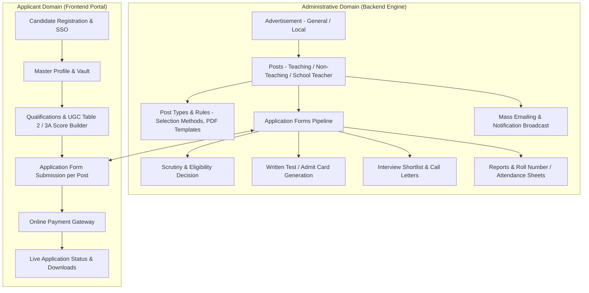

# AMU Careers Portal: UI/UX & Administrative Workflow Design Specifications

> **Source Material:** Production Reference Screenshots from `datalake.amuonline.ac.in` and `mcareers.amuonline.ac.in`  
> **Target System:** `betacareers.amuonline.ac.in` (Modernized, Secure, High-Performance Recruitment Engine)  
> **Image Directory:** `application/docs/images/`

---

## Table of Contents
1. [System Architectural Hierarchy](#1-system-architectural-hierarchy)
2. [UI Screen Index & Visual References](#2-ui-screen-index--visual-references)
   - [Screen 0: Candidate & Admin Authentication (Sign-In Interface)](#screen-0-candidate--admin-authentication-sign-in-interface)
   - [Screen 1: Admin Master Dashboard (Analytics & Financial Metrics)](#screen-1-admin-master-dashboard)
   - [Screen 2: Advertisements Management (Local & General Listings)](#screen-2-advertisements-management)
   - [Screen 3: Advertisement Detail View & Associated Posts](#screen-3-advertisement-detail-view)
   - [Screen 4: Post Detail & Application Pipeline Statistics](#screen-4-post-detail--pipeline-statistics)
   - [Screen 5: Detailed Applicant Dossier Card & Inspection Grid](#screen-5-detailed-applicant-dossier-card)
   - [Screen 6: Multi-Stage Eligibility & Scrutiny Modal](#screen-6-multi-stage-eligibility--scrutiny-modal)
   - [Screen 7: Post Types Configuration & Selection Method Workflow](#screen-7-post-types-configuration)
   - [Screen 8: Examination & Interview Attendance Sheet Generator](#screen-8-attendance-sheet-generator)
   - [Screen 9: Bulk Document Generation (Admit Cards & Call Letters)](#screen-9-bulk-document-generation)
3. [Core Administrative Workflows & Functional Requirements](#3-core-administrative-workflows--functional-requirements)
4. [Frontend Candidate Journey Specifications](#4-frontend-candidate-journey-specifications)
5. [Database Entity Alignment Matrix](#5-database-entity-alignment-matrix)

---

## 1. System Architectural Hierarchy

The AMU Careers portal operates on a clear relational hierarchy spanning two distinct portals:

---

## 2. UI Screen Index & Visual References

---

### Screen 0: Candidate & Admin Authentication (Sign-In Interface)

*Figure 0: Split-screen Sign-In Interface featuring the AMU Seal logo, floating frosted glass login card, custom form styling, and high-resolution hero imagery of Victoria Gate, AMU Aligarh.*

#### Key Design Elements & Architecture:
- **Left Branding & Authentication Pane**:
  - University Emblem & Header: `ALIGARH MUSLIM UNIVERSITY` / `Office of the Controller of Examinations`.
  - Floating Card with Soft Elevation & Glassmorphism border.
  - Centered AMU Green Insignia with bold `Sign In` title.
  - **Form Controls**:
    - `USERNAME OR EMAIL` input with subtle focus transition (`e.g. user@amu.ac.in or username`).
    - `PASSWORD` input with integrated visibility toggle eye icon.
    - Custom styled `Keep me signed in` checkbox.
    - Full-width AMU Forest Green primary action button (`Sign In` - `#0c4a2e`).
    - Secondary assistance anchor (`Need help signing in?` -> routes to password recovery / helpdesk).
  - Subtle copyright footer: `© 2026 Aligarh Muslim University. All rights reserved.`
- **Right Hero Photography Pane**:
  - Smooth asymmetrical curved container housing the iconic **Victoria Gate (Bab-ul-Ilm)**, Aligarh Muslim University.
  - Floating pill overlay tag at bottom right: `🟢 Victoria Gate · AMU Aligarh`.

---

### Screen 1: Admin Master Dashboard

*Figure 1: Executive Dashboard with KPI Cards, 12-Month Application Trends, Goal Completions, Financial Health, and Recent Applications/Members.*

#### Key Components & Functionality:
- **KPI Metrics Ribbon**:
  - `Advertisements`: Total active/archived recruitment notifications (e.g. 1,045).
  - `Total Posts`: Cumulative distinct positions advertised (e.g. 2,874).
  - `Total Applications`: Aggregate applicant volume across all posts (e.g. 79,659).
  - `Registered Users`: Total verified candidate accounts (e.g. 55,050).
- **Application Trends Visualization**:
  - 12-month dual-axis / area line chart comparing **Submitted Applications** vs. **Paid Applications** over time.
- **Goal Completion Status Bars**:
  - `Paid Applications` (e.g. 48,381 / 79,659 - 60.7%)
  - `Submitted Applications` (e.g. 63,907 / 79,659 - 80.2%)
  - `Applications in Review` (e.g. 15,752 / 79,659 - 19.8%)
- **Financial Transaction Breakdown**:
  - 🟢 **Total Amount Received**: Successful fee payments (e.g. ₹2,29,94,500).
  - 🟡 **Awaited / Incomplete Transactions**: Pending checkout sessions (e.g. ₹22,25,500).
  - 🔴 **Failed Transactions**: Gateway drop-offs / rejections (e.g. ₹93,14,500).
- **Live Activity Feeds**:
  - Recent Applications table (Application ID, Post Name, Submission Status badge, Timestamp).
  - New Member Registration feed with user avatars and timestamp.

---

### Screen 2: Advertisements Management

*Figure 2: Advertisement Table (Local Type Filtered) with DataTables Export Tools (Copy, CSV, Excel, PDF, Print, Column Visibility).*

*Figure 3: Advertisement Table (General Type Filtered) showing historical and current general notifications.*

#### Key Columns & Features:
- **Filters & Search**: Per-column search (ID, Title, Slug, Dated, Type dropdown: `All`, `Local`, `General`).
- **Bulk Operations**: Multi-select checkboxes with `Select All`, `Deselect All`, and `Delete Selected`.
- **Export Toolbar**: Instant export to CSV, Excel, PDF, Clipboard, or Print format.
- **Row Actions**: Direct links to `View`, `Edit`, and `Delete` advertisement instances.

---

### Screen 3: Advertisement Detail View & Associated Posts

*Figure 4: Single Advertisement Overview showing metadata, PDF links, aggregate statistics, and child posts.*

*Figure 5: Large Advertisement View (ADVERTISEMENT NO. 2/2026/NT) with 710 Paid, 765 Submitted, 954 Total, and multiple non-teaching post rows.*

#### Data Points & Actions:
- **Metadata Card**: ID, Full Title, URL Slug, Description Toggle, Notification Date, Type (`Local` vs. `General`), Document URL button (`View`).
- **Applications Statistics Summary**:
  - `Paid Applications`: Count of applicants with confirmed fee receipts.
  - `Submitted Applications`: Total completed submissions.
  - `Total Applications`: Including drafted/unpaid attempts.
- **Bulk Action Buttons**:
  - 🟩 `Download Paid Applications`: Generates compiled ZIP/PDF of all paid applicant dossiers.
  - 🟨 `Download All Applications`: Compiles all submitted forms.
- **Child Posts Sub-Grid**:
  - Post ID, Post Type (`LOCAL TEACHING`, `GENERAL NON TEACHING`, etc.), Job Title & Department, Pay Level (e.g. `AL-10`, `Pay Level-12`), Application Fee (e.g. `₹500`), Opening & Closing Timestamps, Withdrawn Status, Application Counters (`Total` / `Submitted` / `Paid` / `Internal Candidate` badge count), Action Buttons (`View Post`, `Download Paid`, `Download All`).

---

### Screen 4: Post Detail & Application Pipeline Statistics

*Figure 6: Individual Post Management Console showing detailed statistics widgets for Applications, Eligibility, and Downloads.*

*Figure 7: System Manager Post with Live Applicant Pipeline Cards and embedded Application Form List.*

#### Pipeline KPI Widgets:
1. **Application Statistics**:
   - `Total Applications` (Total initiated)
   - `Submitted` (Final submit completed)
   - `Paid` (Payment verified)
2. **Eligibility & Scrutiny Statistics**:
   - 🔍 `Scrutiny Eligible`: Number of candidates marked eligible by the scrutiny committee.
   - 👤 `Eligible for Interview`: Candidates shortlisted for the selection committee interview.
3. **Download Statistics**:
   - ✉️ `Interview Letters`: Download/dispatch counter for interview call letters.

---

### Screen 5: Detailed Applicant Dossier Card & Inspection Grid

*Figure 8: High-density applicant review row showing photo, profile, multi-address, full academic trajectory, experience, and eligibility action.*

#### Visual Information Layout:
- **Col 1 (Basic Details)**: User ID, Application ID, Profile Photograph, Full Name, Father's Name, Mother's Name, Spouse Name, Email, Gender, Date of Birth, Calculated Age (Years & Months), Mobile, Disability Type & %, Religion, Category, Caste, Total Claimed Experience, Submission Timestamp, and Cross-Application History (links to other posts applied by this user with dates).
- **Col 2 (Address)**: Full Correspondence Address with PIN code, Full Permanent Address with PIN code, Domicile District & State.
- **Col 3 (Qualifications)**: Chronological degrees with University/Board, Year of Passing, Percentage / CGPA (e.g., Secondary School 60.6%, Senior Secondary 50.75%, B.Tech 6.28 CGPA).
- **Col 4 (Experience)**: Organization, Designation, Pay Scale, Duration, Nature of Duties.
- **Col 5 (Referees & Testimonials)**: Referee names, designations, and uploaded testimonial status.
- **Col 6 (Institutions Attended)**: Schools, Colleges, and Universities attended with years.
- **Col 7 (Action)**: 🟨 `Eligibility` button to trigger the Scrutiny Decision Modal.

---

### Screen 6: Multi-Stage Eligibility & Scrutiny Modal

*Figure 9: Three-Tier Evaluation Modal for Scrutiny, Written Test, and Interview Decisions with Remarks.*

#### Three-Tier Evaluation Workflow:
| Stage | Decision Dropdown | Remark Field | Purpose |
| :--- | :--- | :--- | :--- |
| **1. Scrutiny** | `Pending` / `Eligible` / `Not Eligible` | Textarea | Initial document verification, minimum qualification check, and API score confirmation. |
| **2. Written Test** | `Pending` / `Eligible` / `Not Eligible` | Textarea | Evaluation of entrance test results (for Non-Teaching / School Teacher posts). |
| **3. Interview** | `Pending` / `Eligible` / `Not Eligible` | Textarea | Final shortlisting for statutory Selection Committee interview. |

---

### Screen 7: Post Types Configuration & Selection Method Workflow

*Figure 10: Master Configuration Table for Post Types defining PDF templates, selection methods, admit card rules, and submission offices.*

#### Master Post-Type Schema:
| ID | Post Type Name | PDF Form Template | Default Selection Method | Admit Card Template | Interview Letter Template | Submission / Receiving Venue |
| :- | :--- | :--- | :--- | :--- | :--- | :--- |
| **1** | GENERAL (Physical Education & Sports) | `fn3_phe` | Interview Only | *None* | `interview_letter` | Selection Committee (Non-Teaching) |
| **2** | GENERAL (Librarian / Dy / Asst Lib) | `fn2` | Interview Only | *None* | `interview_letter` | Selection Committee (Non-Teaching) |
| **3** | GENERAL (Non Teaching Post) | `fn3_general_nt` | **Written Test + Interview** | `admit_card` | `interview_letter` | Selection Committee (Non-Teaching), Registrar's Office |
| **4** | GENERAL (School Teacher) | `fn3_general_st` | **Written Test + Interview** | `admit_card` | `interview_letter` | Selection Committee (Non-Teaching), Registrar's Office |
| **5** | GENERAL (TEACHING POST) | `fn1` | **Interview Only** | *None* | `interview_letter` | Joint/Deputy Registrar, Selection Committee (Teaching) |
| **6** | LOCAL (TEACHING POST) | `fn1` | **Interview Only** | *None* | `interview_letter` | Concerned Chairman / Dean of the Faculty |
| **7** | LOCAL (School Teacher) | `fn3_general_st` | **Interview Only** | *None* | `interview_letter` | Directorate of School Education, AMU |

---

### Screen 8: Examination & Interview Attendance Sheet Generator

*Figure 11: Attendance Sheet Generation Interface for examination halls and interview boards with photo and barcode toggles.*

#### Configuration Options:
- `Select Advertisement`: Dropdown of active recruitment drives.
- `Select Post`: Filtered list of posts under the chosen advertisement.
- `Has Roll No been Uploaded/Generated?`: Binary toggle (`YES` / `NO`).
- `Select Report Type`: `ALL` / `Scrutiny Eligible Only` / `Interview Eligible Only`.
- `With Photo?`: Include applicant passport photo on the printable attendance sheet (`YES` / `NO`).
- `With Barcode?`: Include machine-scannable application barcode for automated OMR / physical verification (`YES` / `NO`).
- `Generate`: Outputs formatted printable PDF attendance register.

---

### Screen 9: Bulk Document Generation (Admit Cards & Call Letters)

*Figure 12: Automated Document Dispatch & PDF Generator for Admit Cards and Interview Call Letters.*

#### Generation Parameters:
- `Select Advertisement` & `Select Post`
- `Document Type`: `Admit Card` (Written Test) or `Interview Letter` (Selection Committee Interview).
- `Filter`:
  - `All Applicants`: Generates documents for all paid submissions.
  - `Eligible Only`: Generates documents exclusively for candidates who passed Scrutiny.
  - `Interview Eligible Only`: Generates call letters exclusively for interview-shortlisted candidates.
- `Generate`: Spawns asynchronous PDF compilation with personalized candidate details, date/time/venue, reporting instructions, and QR verification stamp.

---

## 3. Core Administrative Workflows & Functional Requirements

### 1. Advertisement & Post Life Cycle Management
- Creation of Advertisements (`General` vs. `Local`).
- Association of child posts with specific `Post Types` (defining whether selection is Interview Only vs. Written Test + Interview).
- Configuration of application fee structure (General category vs. SC/ST/PwBD exemptions).
- Setting distinct timeline milestones: Opening date, Closing date, Payment cutoff date, and Document submission deadline.

### 2. Candidate Scrutiny & Scoring Workflow
- Automated baseline calculation of UGC Table 3A / Table 2 scores.
- Committee evaluation console: Mark candidate as `Eligible`, `Not Eligible`, or `Pending` with mandatory audit remarks.
- Integrated Grievance Window: Allow candidates to review provisional screening remarks and submit online objections with supplementary proofs.

### 3. Mass Communication & Email Engine
- Bulk Emailing Module: Administrators can target specific applicant segments:
  - All applicants of an Advertisement or Post.
  - Only `Eligible` or `Shortlisted` candidates.
  - Candidates with pending fee payments or missing documents.
- Template variables support (e.g. `{NAME}`, `{APPLICATION_ID}`, `{POST_TITLE}`, `{INTERVIEW_DATE}`, `{VENUE}`).

### 4. Examination & Document Dispatch Automation
- Automated Roll Number Assignment: Sequential or random roll number generator for written tests.
- Printable Attendance Registers with candidate photos, signatures, and barcodes.
- Automated generation of digitally signed Admit Cards and Interview Call Letters available for download on candidate dashboards.

---

## 4. Frontend Candidate Journey Specifications

1. **Candidate Onboarding & SSO**:
   - Email and mobile OTP verification.
   - Profile completeness meter (Personal Info, Photo & Signature, Academic Qualifications, Work Experience, Research Publications).
2. **Interactive UGC API & Score Calculator**:
   - Candidate enters graduation, PG, NET/JRF, Ph.D. details; portal computes Table 3A score in real-time with statutory capping rules.
   - Research publication form with DOI lookup for instant metadata extraction.
3. **Application Review & Checkout**:
   - Multi-post application cart.
   - Integrated payment gateway with instant webhook auto-reconciliation.
4. **Candidate Command Center**:
   - Real-time application timeline tracking (`Submitted` -> `Under Scrutiny` -> `Screening Score Published` -> `Admit Card Ready` -> `Interview Call Letter Issued`).
   - Download submitted application PDF, payment receipts, admit cards, and call letters.

---

## 5. Database Entity Alignment Matrix

The visual administrative interfaces map directly to our newly structured `betacareers_db` schema:

| UI Interface / Function | Primary Database Tables in `betacareers_db` |
| :--- | :--- |
| **Advertisements Management** | `advertisements`, `advertisement_types` |
| **Post Types Configuration** | `post_types` |
| **Posts & Fee Configuration** | `posts` |
| **Application Submission Pipeline** | `application_forms`, `profiles`, `users` |
| **Academic & Professional Data** | `academic_qualifications`, `boards`, `employment_histories`, `institutions_attendeds`, `foreign_visits`, `referees`, `other_details` |
| **Normalized Master Lookups** | `castes`, `categories`, `countries`, `disability_types`, `marital_statuses`, `postal_codes`, `provinces`, `religions`, `qualification_levels`, `traeds` |
| **Media & Photographs** | `media`, `photos` |
| **Scrutiny & Audit Logs** | `audit_logs`, `roles`, `permissions`, `role_user`, `permission_role` |
